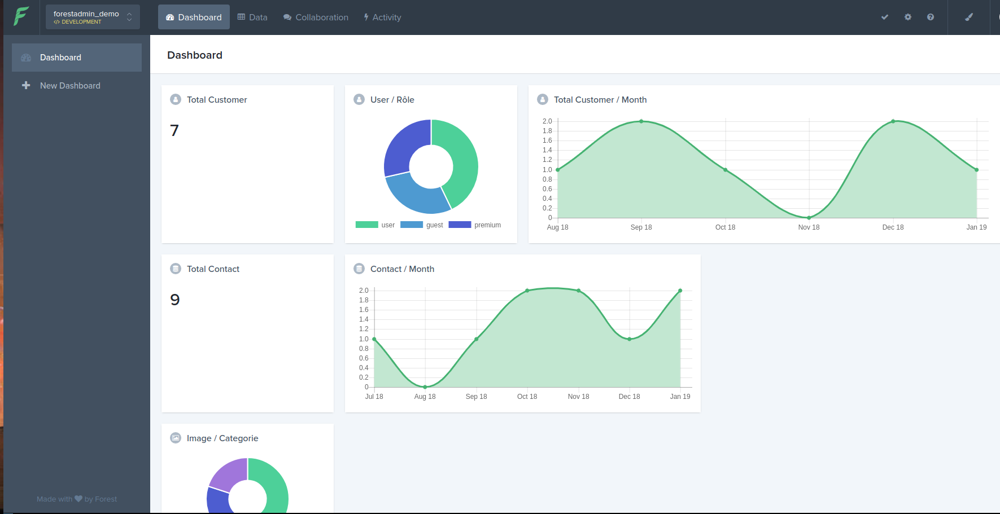

## Foresadmin Example



### Requirments

- Docker CE version 18+
- Docker-compose 1.20+
- A forestadmin.com account

### Usage

- **Create a new project on forestadmin.com**

  - Create new account on forestadmin.com & log in
  - Choose "Create a new project" option
  - Choose "Install Forest with Express/Sequelize"
  - Create `.env` files from template `.env.local`
  - Set correct value for the `FOREST_AUTH_SECRET` & `FOREST_ENV_SECRET` variable in `.env` file
  - Install Express app (see section below)
  - Enter "http://forestadmin.localhost" as "application url"
  - Click on Verify button (only when make install is done !)

- **Install Express app & init demo database**

```bash
make install
```

Done !

### Other

- **Display available make targets**

```bash
make help
```

- **Access lumber cli**

Lumber is the forest admin cli, is it pre-installer on the docker image

```bash
make ssh

lumber --help
```

- **Update Express database models**

```bash
make ssh

lumber update
> Your admin is up to date.
```

- **Start new psql console**

```bash
make db.cli

psql (11.1)
Type "help" for help.
forestadmin_demo=#
```
